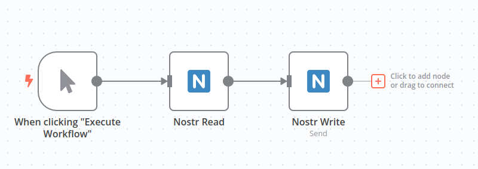

日本語は[こちら](./README-ja.md)。

# n8n-nodes-Nostrobots

n8n node for nostr.

This is an n8n community node. It lets you use nostr in your n8n workflows.

[Nostr is the simplest open protocol. that is able to create a censorship-resistant global "social" network once and for all.](https://github.com/nostr-protocol/nostr)


[n8n](https://n8n.io/) is a [fair-code licensed](https://docs.n8n.io/reference/license/) workflow automation platform.

* [Installation](#installation)  
* [Operations](#operations)  
* [Credentials](#credentials)
* [Usage](#usage)
* [Resources](#resources)  

## Installation

Follow the [installation guide](https://docs.n8n.io/integrations/community-nodes/installation/) in the n8n community nodes documentation.

## Operations

- [Nostr Write (Nostrobots)](./doc/write.md)
  - Send kind1 note
  - Send event(advanced)
  - Raw Json Event(advanced)
  - Encrypted Direct Message (NIP-04)
- [Nostr Read](./doc/read.md)
  - Fetch kind1 events
    - Query by eventId, public key, search word(NIP-50), hashtag, mention, and json filter
  - Encrypted Direct Message reading (NIP-04) 
- [Nostr Utils](./doc/utils.md)
  - Conversion from event to naddr, nevent
  - Transform bech32, hex representation of keys to each other
  - Decrypt NIP-04 encrypted messages
- [BETA] [Nostr Trigger](./doc/trigger.md)
  - Trigger n8n workflow by subscribing to events
  - Triggering workflows by mentions to specific npubs
  - Ability to limit execution frequency (per all, per event creator)

## Credentials

- Secret Key
  - You can use bech32 or lower case hex string.

## Usage

[Let's try the tutorial on creating an RSS feed bot.](./doc/rss-feed-bot.md).

## Resources

* [n8n community nodes documentation](https://docs.n8n.io/integrations/community-nodes/)
* [nips](https://github.com/nostr-protocol/nips#nips)


## Test in local

Please read [Run your node locally](https://docs.n8n.io/integrations/creating-nodes/test/run-node-locally/#run-your-node-locally).

``` sh
# project root path
yarn build
yarn link

# move to n8n node directory. eg. ~/.n8n/nodes
yarn link n8n-nodes-nostrobots
n8n start
```

### Unit test

``` sh
yarn test
```

## lint

``` sh
yarn format
yarn lint
```

## TODO

- Trigger node by getting event from relay.

## See also

- [ノーコードで作るnostrボット - n8n-nostrobots](https://habla.news/u/ocknamo@ocknamo.com/1702402471044) (japanese)

## License

[MIT License](LICENSE.md)
